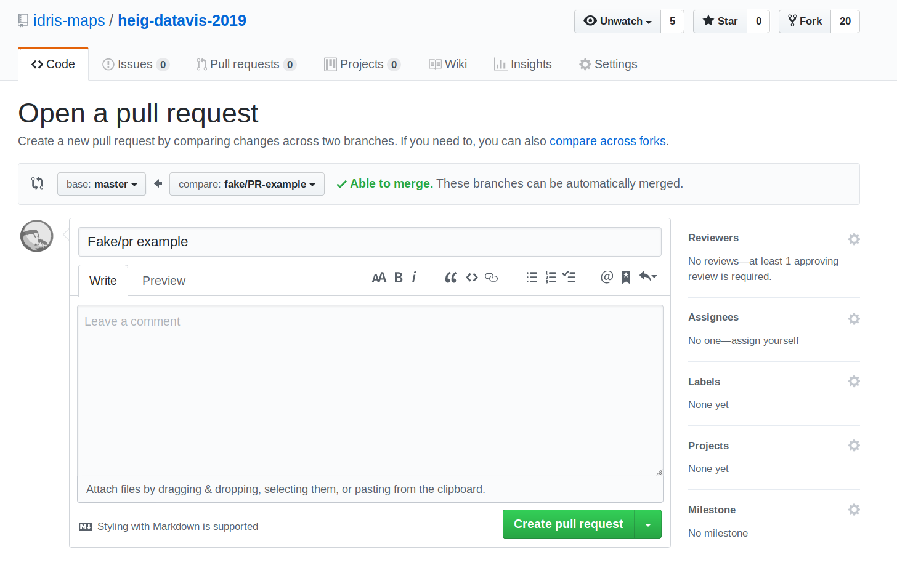

# 01 Mars 2019

## Précisions

### Vidéos SVG

* [Sara Soueidan - Building Better Interfaces With SVG](https://www.youtube.com/watch?v=lMFfTRiipOQ)
* [SVG can do that?! (Sarah Drasner)](https://www.youtube.com/watch?v=ADXX4fmWHbo)

### [Observables](https://beta.observablehq.com/)

* Vous pouvez modifier et "forker" toutes les pages
* Les préfixes `md`, `svg`, `html`... servent à déclarer comment la suite doit être interprêtée.

### Exercices sur github

* Créez une branche pour l'exercice

```bash
git checkout master
git pull
git checkout -b <NOM_DE_L_EXERCICE>/<NOM_SUR_GITHUB>
```

Au pire si ça ne marche pas, effacez le dossier et

```
git clone git@github.com:idris-maps/heig-datavis-2019.git
```

* Utilisez votre nom sur github pour identifier votre fichier

`<NOM_SUR_GITHUB>.<EXTENSION>`

* Mettez le fichier dans le dossier de l'exercice
* Vérifiez que vous ne poussez que le / les fichiers voulus
* Créez un "pull request"




## Retour [dessins](https://github.com/idris-maps/heig-datavis-2019/tree/master/20190222-intro/dessins)

## SVG dans une page web

### SVG et CSS

* [Liste des attributs qui peuvent être définis en CSS](http://tutorials.jenkov.com/svg/svg-and-css.html)

### Interaction avec javascript

Exemples commentés:

* [Événement "click"](https://github.com/idris-maps/heig-datavis-2019/blob/master/20190301-manipulation-dom/exemple_1.html)
* [Taille du SVG en fonction de la taille du navigateur](https://github.com/idris-maps/heig-datavis-2019/blob/master/20190301-manipulation-dom/exemple_2.html)
* [Positionner un élément en fonction de la taille du navigateur](https://github.com/idris-maps/heig-datavis-2019/blob/master/20190301-manipulation-dom/exemple_3.html)
* [Événement "mousemove"](https://github.com/idris-maps/heig-datavis-2019/blob/master/20190301-manipulation-dom/exemple_4.html) 

### Introduction à D3

* [Manipulation DOM](https://beta.observablehq.com/@idris-maps/d3-manipulation-dom)
* [Joindre des données](https://beta.observablehq.com/@idris-maps/d3-joindre-des-donnees-a-des-elements)